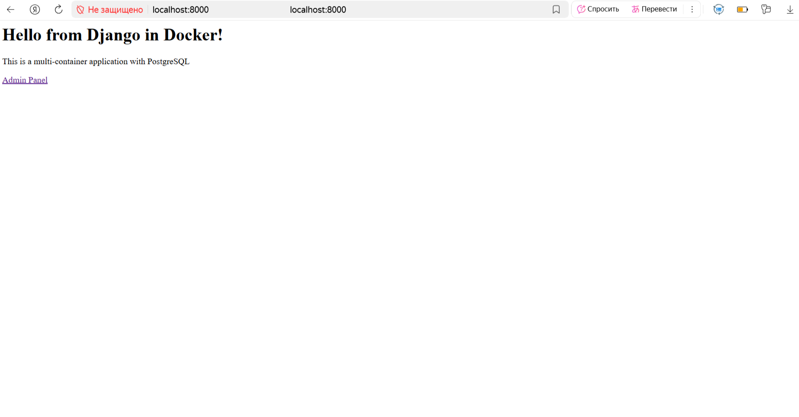
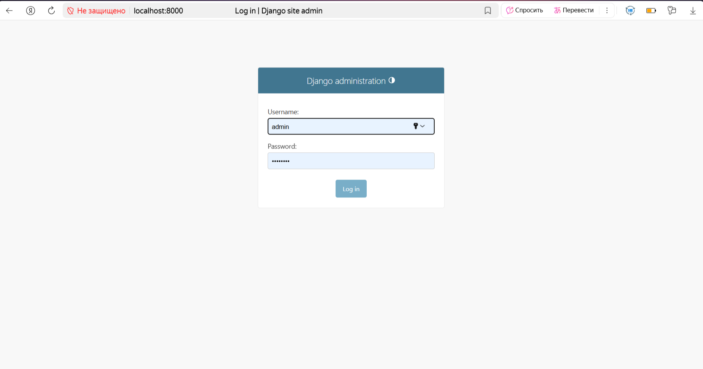
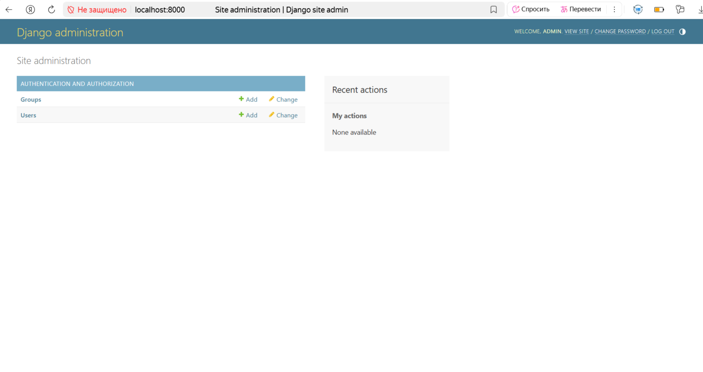
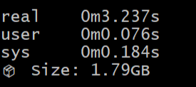
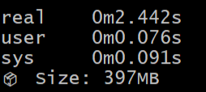
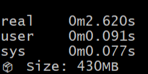
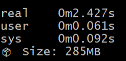
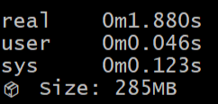

# Отчёт по 2 лабораторной(обычная).
## Хорошие и плохие практики по написанию Dockerfile

Будем контейнеризировать простое веб-приложение на django и postgres, которое представляет из себя домашнюю привественную страницу и панель администртора с авторизацией.







## Плохой Dockerfile
Время сборки и размер образа плохого Dockerfile.
### 1) Полный образ python
```docker
FROM python:3.11
```

Полный образ содержит ненужные в production инструменты, которые увеличивают размер образа, тем самым замедляя деплой проекта:
- Компиляторы (gcc, make)
- Системные утилиты (vim, curl, wget)
- Документация и man-страницы
- Build-essential tools

Также каждый лишний пакет - потенциальная уязвимость безопасности.

Злоумышленник может:
- Скомпилировать эксплойты
- Модифицировать системные библиотеки
- Создать бэкдоры


### 2) Множественные RUN команды и кэширование при установке
```docker
RUN pip install -r requirements.txt django-debug-toolbar ipython
(...)
RUN chmod +x django_app/entrypoint.sh
```

Каждая команда RUN создает новый слой в образе. Это увеличивает итоговый размер и уменьшает эффективность кэширования при пересборках.


### 3) Используем ADD для локальной копии, тянем весь контекст
```commandline
ADD . /app
```

ADD имеет лишнюю функциональность:
- распаковка архивов
- загрузка из URL, которая не нужна для копирования локальных файлов

Также отсутствует прозрачность, непонятно что именно загружается.


### 4) Запуск от root
```docker
# НЕТ инструкции USER - значит запуск от root!
ENTRYPOINT ["django_app/entrypoint.sh"]
CMD ["python", "django_app/manage.py", "runserver", "0.0.0.0:8000", "--insecure"]
```

Если злоумышленник получает доступ в контейнер, он имеет полный контроль:
```bash
# В контейнере от root можно:
whoami  # root
apt-get install hacking-tools  # Установить вредоносные программы
mount /dev/sda1 /mnt  # Попытаться смонтировать хост-систему
```
Root-пользователь может эксплуатировать уязвимости ядра для "побега" из контейнера на хост-систему.

При монтировании volumes root может читать/изменять файлы хоста:
```bash
docker run -v /:/host root-container
# Теперь в контейнере: rm -rf /host/etc  # Удалить системные файлы
```


## Хороший Dockerfile
Сейчас будем пошагово исправлять ошибки и сравнивать с исходными значениями, явно прослеживать улучшения с помощью улучшенных значений затраченного памяти и времени.
### 1) Использование slim(или digest) версии образов, когда это уместно
Slim-образы — это образы Docker, в которых присутствует минимальное количество пакетов(которых возможно будет недостаточно, так что отталкивайтесь от вашего конкретного случая). 

НО Обычный тег(3.11-slim) может меняться, если автор решит его пересобрать.

Если вы для себя решили, что это окончательная версия образа, и не собираетесь никак его обновлять, то
лучше использовать фиксированные - digest образы.

Узнать digest образ из dockerhub можно командой:
```bash
docker manifest inspect python:3.11-slim | grep digest
```

Исправление в Dockerfile:
```docker
FROM python:3.11-slim
```

#### Показатели:
Было: 



Стало: 



### 2) Запуск от обычного пользователя


Исправление в Dockerfile:
```
# Создать пользователя
RUN groupadd -r appuser && useradd -r -g appuser appuser
(...)
RUN chown -R appuser:appuser /app
# Сменить пользователя
USER appuser
```

Запуск от обычного пользователя способствует:

- Исправление в Dockerfile:
```bash
# Если взломали приложение:
whoami                    # → appuser (вместо root)
apt-get install malware   # → Permission denied
rm /etc/passwd           # → Permission denied
```

- Защита от container escape - это когда злоумышленник "сбегает" из изолированного контейнера на хост-систему.
- Изоляция процессов
```bash
# Процессы запускаются от appuser
ps aux
# appuser   1  0.0  0.1   python app.py
# вместо:
# root      1  0.0  0.1   python app.py
```

#### Показатели:
Было: 


Стало: 



На данном этапе RUN еще не объедены в один, потому создался дополнительный слой образа за счёт:
```docker
RUN chown -R appuser:appuser /app
```
Изменений в статистике не наблюдается, зато повысилась безопасность.
### 3) Используем COPY для копирования ТОЛЬКО нужных файлов(+ .dockerignore)
Распишем .dockerignore для того чтобы не копировались ненужные файлы.
```
.git
docker-compose.yml
.env
Dockerfile
*.log
__pycache__
./.idea
env
.gitignore
```


Исправление в Dockerfile:
```docker
# Копировать только нужное
COPY requirements.txt .
# Чистим кэш при установке
RUN pip install --no-cache-dir -r requirements.txt
# Копировать код
COPY django_app/ .
```
Также избавились от перемещения по директориям, т.к. скопировали непосредственно проект.

#### Показатели:
Было: 


Стало: 



### 4) Минимальное количество RUN

Исправление в Dockerfile:
```docker
RUN chmod +x /app/entrypoint.sh && \
    chown -R appuser:appuser /app
```

Важно! Необходимо объединять логически связанные RUN, например, несколько скачиваний и т.д.
В моем плохом примере на самом деле всё в порядке, просто выбранный проект не позволяет отобразить хорошо данную проблему.

Один RUN как было написано выше по сути - один слой. 

Тем меньше слоёв - тем меньше размер образа.

Объединённые RUN кэшируются как единый блок и при последующих изменениях какой-то конкретной зависимости будет пересобираться только этот слой. 
#### Показатели:
Было: 


Стало: 




## Плохие практики по работе с КОНТЕЙНЕРАМИ

### 1) Внесение данных в работающий контейнер

Ключевой принцип работы Docker: контейнеры эфемерны, а их файловая система состоит из слоев.

Образ — это статичный, неизменяемый набор файлов

Контейнер — работающий экземпляр, который добавляет тонкий записываемый слой поверх образа
```text
[ Слой контейнера (Read-Write) ]  <- Все ваши изменения во время работы
[ Слой образа (Read-Only) ]        <- Исходные файлы приложения
```
#### Проблема:

- Вы запускаете контейнер и начинаете вносить изменения

- Все новые файлы и модификации записываются в верхний (контейнерный) слой

- При остановке и удалении контейнера этот записываемый слой удаляется навсегда

- Новый контейнер запускается с чистым слоем поверх исходного образа

#### Решение:
По-хорошему, приложение в контейнере должно быть stateless (без состояния). Это означает, что во время работы не должно создаваться критически важных данных внутри контейнера. Все постоянные данные должны храниться во внешних системах: базах данных, томах, облачных хранилищах.

НО, существуют ситуации, когда всё-таки нужно работать внутри контейнера, например:
1. Диагностика и поиск проблем

2. Внесение временных изменений ради эксперимента, которые не жалко потерять

3. Необходимо быстро "залатать" проблему до полноценного исправления

Для 2, в случае успеха, и 3 пунктов хотелось бы не утратить внесённые изменения, чтобы они сохранялись между запусками.

#### Использование томов (Docker Volumes)

Docker Volumes — это механизм для постоянного хранения данных, который существует отдельно от жизненного цикла контейнеров. В отличие от данных внутри контейнера, которые удаляются вместе с ним, томы сохраняют информацию при перезапуске, обновлении или удалении контейнеров.

```bash
# Создаем том для данных
docker volume create app_data

# Подключаем том при запуске
docker run -v app_data:/var/lib/app/data my-application
```

### 2) Неожиданная перезапись данных из volume

#### Проблема:

Вот вы узнали о volumes и решили поизучить, пощупать самостоятельно, что это такое и с чем его едят. Создали том, подключили контейнерПодготовили том с предустановленными конфигурационными файлами для вашего приложения. Вы подключили его к новому контейнеру, запустили его, а ваши кастомные конфиги исчезли, были заменены стандартными файлами из образа.

Почему это происходит?

Механизм работы здесь такой:

- Вы подключаете том (пустой) к пути внутри контейнера (например, /app/config).

- При запуске контейнера Docker монтирует том в указанную директорию.

- Ключевой момент: Если том ПУСТ, а в образе по этому пути уже есть файлы, Docker копирует все содержимое из образа в том при первом запуске.

- Если же в томе уже есть данные, он просто монтируется поверх директории образа, и файлы из образа становятся невидимыми.

- Вы ожидали, что ваш непустой том подхватится приложением, но если вы запускаете контейнер впервые с этим томом, он инициализируется данными из образа, перезаписывая всё, что вы, возможно, туда уже положили.

#### Решение: 
#### Понимание логики инициализации

Для данных приложения (БД): Вы подключаете том к пустой директории (например, /var/lib/postgresql/data), и при первом запуске СУБД инициализирует его своими стартовыми данными. При последующих запусках том уже не пуст, и СУБД просто использует существующие данные.

Это работает потому, что в официальных образах БД (PostgreSQL, MySQL, Redis) data-директории изначально пустые. Docker видит пустой том и пустую папку в образе — и ничего не копирует, позволяя СУБД самой проинициализировать данные.

Для конфигурационных файлов: Здесь нужно быть осторожным. Проблема возникает потому что папка в образе УЖЕ содержит конфиги (приложение не может работать без базовой конфигурации). Если подключить пустой том к такой папке, Docker автоматически скопирует все дефолтные конфиги из образа в том, перезаписав ваши кастомные настройки.

Способ А (Лучший): Спроектировать приложение так, чтобы оно могло запускаться с пустой директорией конфигов и создавало файлы с настройками по умолчанию при первом запуске. Ваши кастомные настройки тогда можно передавать через переменные окружения.

Способ Б: Заранее заполнить том данными до его ПЕРВОГО использования контейнером. Это можно сделать, запустив вспомогательный контейнер, который скопирует файлы в том.

```bash
# Создаем том
docker volume create my_config

# Запускаем временный контейнер, чтобы заполнить том конфигами
docker run -it --rm -v my_config:/target -v $(pwd)/my_custom_configs:/source alpine cp -r /source/* /target/
```
Как результат, мы получаем том, готовый к использованию в основном контейнере, а временный контейнер-копировщик удалён.

