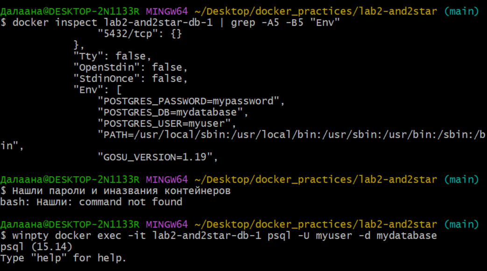
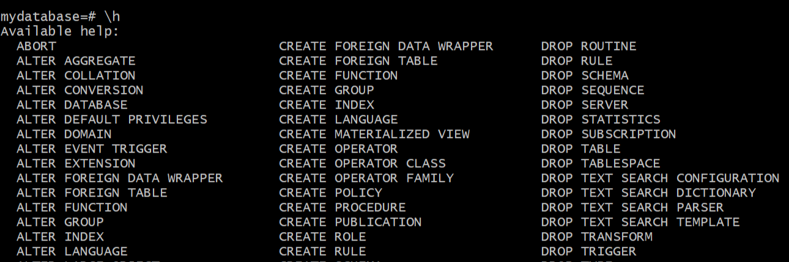
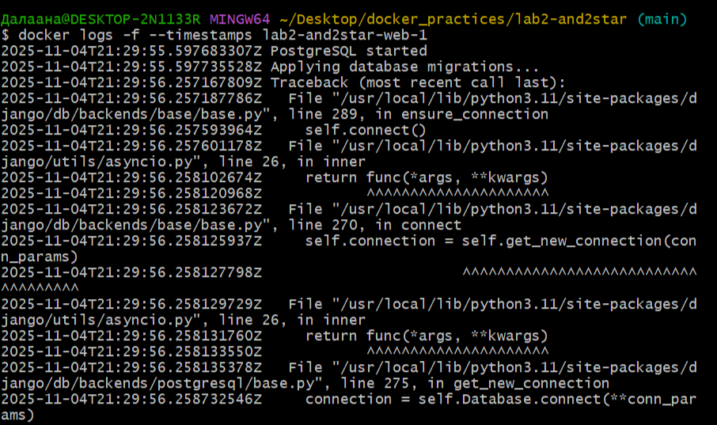
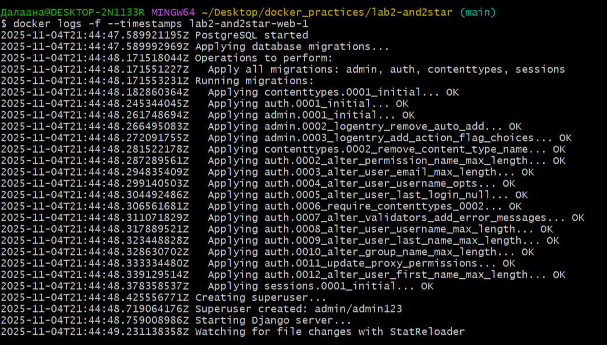
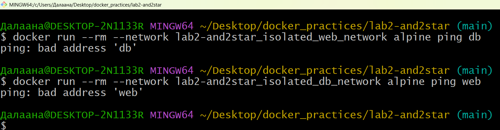

# Отчёт по 2 лабораторной(со звёздочкой).
## Хорошие и плохие практики по написанию docker-compose

Будем контейнеризировать простое веб-приложение на django и postgres, которое представляет из себя домашнюю привественную страницу и панель администртора с авторизацией.


## Плохой docker-compose

### 1) Секреты в коде
```docker
services:
    db:
        environment:
            POSTGRES_DB=kuku
            POSTGRES_USER=kareku
            POSTGRES_PASSWORD=kukareku
    (...)
    web:
        environment:
          - POSTGRES_HOST=db
          - POSTGRES_DB=mydatabase
          - POSTGRES_USER=myuser
          - POSTGRES_PASSWORD=mypassword
          - DJANGO_SECRET_KEY=your-secret-key-here
    (...)
```
Рассмотрим сценарий.

Допустим, злоумышленник как-то получил доступ к вашему серверу(ваш пк), на котором находится веб-приложение, и права на написание docker-команд.

Тогда он может, если захочет, просто просмотреть работающие контейнеры, затем пройтись по их содержимым, и, опа, оказывается секреты прописаны прямо внутри docker-compose. Тогда он их вытянет, условно через grep, и получит доступ также и ко всему серверу.  

Что мы сейчас имеем:





Т.к. всё это дело происходит в локальной сети, а PostgreSQL настроен на trust аутентификацию для localhost, то пароль вводить не пришлось, ну у злоумышленника всё равно пароль так-то есть.

В общем данная практика увеличивает риски компрометации.

### 2) Порты БД наружу
```
services:
    db:
        (...)
        ports:
            - 5433:5432
```

#### Почему это плохо:


- Unnecessary Exposure - БД доступна извне, когда это не требуется(конкретно в нашем случае других сервисов нет прост)

- Port Scanning - автоматические сканеры находят открытые порты

- Direct Attacks - возможность прямых атак на СУБД

- Network Eavesdropping - трафик может перехватываться


```bash
# Любой кто имеет доступ к хосту может:
nmap -p 5432 localhost          # Обнаружить БД
psql -h your-server-ip -U myuser  # Подключиться извне

# И потенциально:
DROP DATABASE mydatabase;       # Удалить базу
SELECT * FROM auth_user;        # Украсть данные
```


### 3) Отсутсвие проверки healthcheck готовности БД
```docker
services:
    web:
        (...)
        depends_on:
            -db
```




Контейнер БД запущен, но это не значит, что она готова принимать подключения
text
 ```text
21:29:55.597 - PostgreSQL started
```
Веб-контейнер сразу начинает применять миграции, не дожидаясь готовности БД
```text
21:29:55.597 - Applying database migrations...
```

БД ещё не открыла порт 5432 для подключений, но веб уже пытается подключиться
```text
21:29:56.257 - connection to server at "db" (172.18.0.2), port 5432 failed: Connection refused
```


Базы данных имеют сложную процедуру инициализации, требующее некоторое время:

- Восстановление журналов транзакций

- Применение отложенных миграций

- Настройка репликации

- Инициализация системных таблиц


## Хороший docker-compose
### 1) Секреты читаются из файла (которые можно поместить в ignore файл)
```docker
services:
    db:
        env_file:
            - .env
        environment:
            POSTGRES_DB: ${POSTGRES_DB}
            POSTGRES_USER: ${POSTGRES_USER}
            POSTGRES_PASSWORD: ${POSTGRES_PASSWORD}
    (...)
    web:
        env_file:
          - .env
        environment:
          - POSTGRES_HOST=db
          - POSTGRES_DB=${POSTGRES_DB}
          - POSTGRES_USER=${POSTGRES_USER}
          - POSTGRES_PASSWORD=${POSTGRES_PASSWORD}
          - DJANGO_SECRET_KEY=${DJANGO_SECRET_KEY}
    (...)
```
Содержимое env_file:
```text
POSTGRES_DB=mydatabase
POSTGRES_USER=myuser
POSTGRES_PASSWORD=secure-password-from-vault
DJANGO_SECRET_KEY=your-real-secure-secret-key-from-vault
```

#### Преимущества использования файлов окружения:
- Защита от попадания в Git - файл с настройками добавляется в .gitignore и не попадает в систему контроля версий

- Разделение настроек по окружениям - возможность использовать разные конфигурации для разработки, тестирования и продакшена

- Простота смены секретов - для обновления данных достаточно изменить файл и перезапустить контейнеры

- Гибкое управление доступом - можно настроить права доступа к файлу только для авторизованных пользователей

- Централизованное управление - все чувствительные настройки хранятся в одном месте

- Безопасное копирование - файл можно безопасно передавать между средами без риска утечки


### 2) Порты БД не экспортируются наружу
```
Порт скрыт
Просто явно не указывается
```
Если не указывать порты БД - происходит контейнерная сеть.
Что происходит:
```text
[ CONTAINER web ] ---> [ CONTAINER db ]
     ↓                      ↓
  172.20.0.3:8000       172.20.0.2:5432
     ↑                      ↑
DOCKER INTERNAL NETWORK (backend)
```
Контейнеры находят друг друга по:
- Docker DNS резолвинг 
- Автоматическое разрешение имен


#### То есть БД теперь доступна только через контролируемое веб-приложение, что значительно снижает поверхность атаки системы.


### 3) Прописанный healthcheck и умный запуск только по готовности БД

Healthcheck - это механизм проверки готовности и работоспособности сервиса внутри контейнера. Docker периодически выполняет команду и по результату определяет, здоров ли контейнер.

#### Преимущества:

- Самовосстановление - автоматические перезапуски при возникновении проблем

- Готовность к оркестрации - совместимость с Kubernetes и другими системами управления контейнерами

- Мониторинг - возможность отслеживать статус работоспособности контейнеров

- Бесперебойные обновления - возможность плавного развертывания без простоев

Применим на практике: 
```docker
services:
    db:
        (...)
        healthcheck:
          test: ["CMD-SHELL", "pg_isready -U myuser -d mydatabase"]
          interval: 5s
          timeout: 5s
          retries: 5
    web:
        (...)
        depends_on:
            db:
                condition:
                    service_healthy
        restart: unless-stopped
```
Вот теперь всё работает.




## Сетевая настройка изоляции


Сетевая изоляция - это следующий уровень защиты после скрытия портов:

    Скрытие портов = защита от внешнего мира

    Сетевая изоляция = защита от внутренних угроз, тобишь сеть делится на максимально мелкие изолированные сегменты, и для каждого сегмента настраиваются строгие правила доступа

Для большинства приложений достаточно первого подхода, но для систем с повышенными требованиями безопасности рекомендуется использовать оба метода одновременно.

#### Подход с гибридной конфигурацией сетей

Чтобы продемонстрировать изоляцию, не нарушая работоспособность приложения, мы использовали гибридный подход - контейнеры подключены как к общей, так и к изолированным сетям:

```yaml
services:
  db:
    networks:
      - app_network      # для нормальной работы
      - isolated_db_network  # для демонстрации изоляции

  web:
    networks:
      - app_network      # для нормальной работы  
      - isolated_web_network  # для демонстрации изоляции

networks:
  app_network:           # общая сеть для взаимодействия
    driver: bridge
    
  isolated_db_network:   # полностью изолированная сеть БД
    driver: bridge
    
  isolated_web_network:  # полностью изолированная сеть веб-приложения
    driver: bridge
```
Что происходит при такой конфигурации:
```text
┌─────────────────┐    ┌─────────────────┐
│   WEB CONTAINER │    │   DB CONTAINER  │
│                 │    │                 │
│ app_network     │◄──►│ app_network     │ ← РАБОТАЕТ
│ 172.20.0.2:8000 │    │ 172.20.0.3:5432 │
│                 │    │                 │
│ isolated_web    │    │ isolated_db     │ ← ИЗОЛИРОВАНО
│ 172.21.0.2:8000 │    │ 172.22.0.2:5432 │
└─────────────────┘    └─────────────────┘
```
#### Почему мы сохранили основную сеть?

Приложение Django + PostgreSQL требует взаимодействия, без общей сети app_network приложение не сможет работать(

Мы продемонстрировали изоляцию, не ломая рабочую систему

### Проверка изоляции:


#### Как добились: Использовали гибридный подход - подключили каждый сервис как к общей сети app_network (для работы приложения), так и к изолированным сетям isolated_web_network/isolated_db_network (для демонстрации изоляции).

#### Принцип изоляции: Docker создает независимые сетевые пространства. Контейнеры в изолированных сетях не видят друг друга - DNS не резолвит имена, а пакеты не маршрутизируются между разными сетями.

#### Результат: Приложение работает через общую сеть, но мы можем продемонстрировать полную изоляцию через дополнительные сети, показывая принцип микросегментации безопасности.


